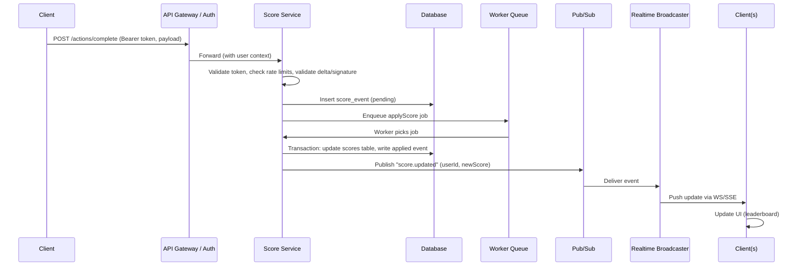

# Specification: Scoreboard API Module

Goal: Provide a backend module that accepts score updates from clients when a user completes an "action", persists scores, and broadcasts realtime leaderboard updates for the top 10 users.

## Feature summary
- Read: return the top 10 users by score.
- Write: clients call an API to increment a user's score when an action is completed.
- Realtime: broadcast leaderboard updates to subscribed clients.
- Anti-fraud: prevent unauthorized or fraudulent score increases.

## High-level architecture
- API Gateway / Auth Service: validates tokens and enforces rate limits.
- Score Service: validates score requests, applies business rules, updates persistence.
- Persistence: durable store (Postgres) plus Redis for leaderboard cache.
- Pub/Sub: Redis Pub/Sub or Kafka to publish "score.updated" events.
- Realtime Broadcaster: WebSocket / Socket.IO or Server-Sent Events (SSE) to push updates.
- Audit / Anti-fraud: component to log events and run heuristics.

## Suggested data model
- users (id, username, ...)
- scores (user_id PK, total_score INT, updated_at)
- score_events (id, user_id, delta, action_type?, client_nonce, verified BOOLEAN, created_at)
- leaderboard cache (Redis sorted set: key = "leaderboard:global", score = total_score)

## REST API Endpoints
1. POST /api/v1/actions/complete
   - Description: client notifies server that a user completed an action; server verifies and enqueues a score event.
   - Authorization: Bearer token (JWT/OAuth2).
   - Body:
     {
       "userId": "string",
       "actionType": "string",      // optional
       "delta": 10,                // points to add (server must verify/cap)
       "clientNonce": "string",    // optional signed proof from client
       "idempotencyKey": "string"  // optional
     }
   - Response:
     202 Accepted
     { "status":"queued", "eventId":"..." }
   - Business rules:
     - Verify token and ensure subject matches userId.
     - Server-side validation: max delta per action, per-user rate limits, verify clientNonce/signature if used.
     - Insert a score_event row (verified = false/true depending on checks).
     - Use a worker queue to apply the score update atomically.
     - Publish "score.updated" via Pub/Sub when applied.

2. GET /api/v1/leaderboard/top10
   - Description: returns top 10 entries from the leaderboard cache (Redis sorted set) with DB fallback.
   - Response:
     { "items": [ { "userId":"...", "username":"...", "score": 123 }, ... ] }

3. WebSocket endpoint
   - WS URL: /ws/scores or Socket.IO namespace
   - On "score.updated" events, broadcast minimal payload (top10 diff or full top10) to subscribed clients.
   - Use auth token during WS handshake.

## Execution flow (sequence)
Use Pub/Sub to separate concerns and enable scaling.

Mermaid sequence diagram:

## Security & anti-fraud measures
- Authentication
  - Require tokens (JWT/OAuth2) for write endpoints.
  - Verify token subject matches userId in payload.
- Authorization
  - Prevent clients from incrementing other users' scores.
- Server-side validation
  - Do not fully trust client-provided delta: enforce per-action caps and validate actionType.
  - Use signed proofs or server-side verification where applicable.
- Idempotency & replay protection
  - Support idempotencyKey to prevent duplicate processing.
  - Store clientNonce/timestamp and reject replays.
- Rate limiting & throttling
  - Apply user/IP rate limits to prevent abuse.
- Audit logs & alerts
  - Persist score_events for investigation.
  - Trigger alerts on suspicious large or rapid score changes.
- Anti-fraud heuristics
  - Monitor behavior patterns (spikes, velocity) and flag suspicious accounts.

## Consistency & scaling
- Use Redis sorted sets for leaderboard (O(log N) update, fast top-K queries).
- Durable DB for authoritative storage; workers apply changes to DB and Redis.
- For high scale, consider sharding or partitioning user data.
- Pub/Sub ensures multiple broadcaster instances remain consistent.

## Implementation notes
- Transaction boundaries: update score and append audit event within the same DB transaction when possible.
- Concurrency: use optimistic locking or appropriate isolation to avoid race conditions on concurrent increments.
- Idempotent jobs: design worker jobs to be idempotent.
- Batching: consider batching frequent small updates to reduce DB load.
- Cache strategy: prefer update-on-write for Redis to keep real-time view accurate.
- Monitoring: track throughput, errors, queue length, and suspicious activity.
- Tests: unit tests for validation, integration tests for end-to-end flow, and load tests for workers and broadcaster.

## Deployment considerations
- Manage secrets for signing and verification keys securely.
- Use rolling deploys for broadcasters and subscribers to minimize missed messages.
- Backpressure: if broadcasters are slow, consider dropping non-critical updates or sending diffs.

## Roadmap / improvements
- Add server-side action verification (signed proofs from authoritative game servers).
- Apply ML for automated fraud detection.
- Provide per-action configurable scoring rules (admin UI).
- Implement real-time compression/diffing to reduce frontend bandwidth.

---

Note: This document is a technical specification intended as a blueprint for backend implementation. Discuss and finalize technology choices (Postgres vs Redis as primary store, WebSocket vs SSE) before implementation.