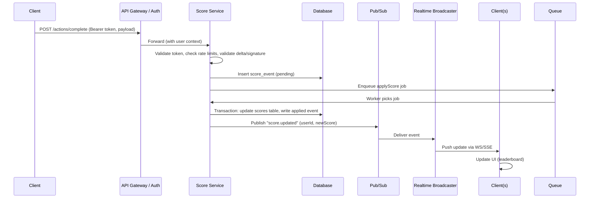

```docs
# Specification: Scoreboard API module

Mục tiêu: Cung cấp module backend để nhận cập nhật điểm từ client khi người dùng hoàn thành một "action", lưu trữ điểm và phát cập nhật realtime cho bảng xếp hạng top 10.

## Tóm tắt chức năng
- Hiển thị top 10 người có điểm cao nhất (read).
- Khi user hoàn thành action, client gọi API để tăng điểm (write).
- Bảng xếp hạng được cập nhật realtime cho các client đang theo dõi.
- Ngăn chặn việc gian lận (không được phép tăng điểm trái phép).

## Kiến trúc tổng quan (components)
- API Gateway / Auth Service: xác thực token, rate limit.
- Score Service: xử lý request tăng điểm, logic hợp lệ, cập nhật DB.
- Persistence: relational DB (Postgres) hoặc NoSQL (Redis + durable store) cho leaderboard.
- Pub/Sub: Redis Pub/Sub hoặc Kafka để phát event "score.updated".
- Realtime Broadcaster: WebSocket / Socket.IO hoặc Server-Sent Events (SSE) để push cập nhật cho các client.
- Audit / Anti-fraud: dịch vụ hoặc thành phần kiểm tra hành vi, logging.

## Mô hình dữ liệu (gợi ý)
- users (id, username, ...).
- scores (user_id PK, total_score INT, updated_at).
- score_events (id, user_id, delta, action_type?, client_nonce, verified BOOLEAN, created_at).
- leaderboard cache (sorted set in Redis: key = "leaderboard:global", score = total_score).

## Endpoint API (REST / JSON)
1. POST /api/v1/actions/complete
   - Mô tả: client gửi khi user hoàn thành action; server xác thực và chuyển thành score event.
   - Authorization: Bearer token (JWT/OAuth2).
   - Body:
     {
       "userId": "string",
       "actionType": "string",      // optional
       "delta": 10,                // points to add (server should verify / cap)
       "clientNonce": "string",    // optional signed proof from client
       "idempotencyKey": "string"  // optional
     }
   - Response:
     202 Accepted
     { "status":"queued", "eventId":"..." }
   - Business rules:
     - Server phải xác minh token -> request.userId matches token subject.
     - Server-side validation: max delta per action, rate limit per user, verify clientNonce/signature if used.
     - Create score_events row (verified = false/true depending on checks).
     - Use worker queue to apply to scores atomically.
     - Emit "score.updated" event via Pub/Sub when applied.

2. GET /api/v1/leaderboard/top10
   - Mô tả: trả về top 10 từ cache (Redis sorted set) hoặc DB fallback.
   - Response:
     { "items": [ { "userId":"...", "username":"...", "score": 123 }, ... ] }

3. WebSocket endpoint
   - WS URL: /ws/scores or via Socket.IO namespace
   - Khi có event "score.updated", server broadcast minimal payload to subscribed clients (e.g. top10 diff hoặc full top10).
   - Use auth token in WS handshake.

## Flow thực thi (sequence)
Sử dụng Pub/Sub để tách concerns và đảm bảo scaling.

Mermaid sequence diagram:


## Bảo mật & chống gian lận (chi tiết)
- Authentication
  - Yêu cầu token (JWT/OAuth2) cho mọi write endpoints.
  - Kiểm tra token subject phải khớp userId trong payload.
- Authorization
  - Không cho phép client trực tiếp tăng điểm của user khác.
- Server-side validation
  - Không tin tưởng client-provided delta hoàn toàn: áp dụng max per-action cap, validate actionType nếu cần.
  - Sử dụng signed proof hoặc server-side action verification nếu action có thể được chia sẻ.
- Idempotency & replay protection
  - Hỗ trợ idempotencyKey khi client gửi request (tránh double submit).
  - Ghi clientNonce/timestamp và từ chối replay.
- Rate limiting & throttling
  - Rate limit theo user / IP để hạn chế lạm dụng.
- Audit logs & alerts
  - Lưu tất cả score_events để điều tra.
  - Cảnh báo khi biến động điểm bất thường (spike detection).
- Anti-fraud heuristics (gợi ý)
  - Kiểm tra hành vi (ví dụ: tốc độ tăng điểm, pattern giống bot).
  - Tạm khóa hoặc gắn flag "requires manual review" cho các account nghi ngờ.

## Consistency & scaling
- Use Redis sorted set cho leaderboard (O(log N) update, O(1) topK).
- DB for durable storage; asynchronous worker applies changes to both DB and Redis.
- For high scale, sharding hoặc partitioning user data.
- Pub/Sub ensures multiple broadcaster instances remain in sync.

## Implementation notes (cho team backend)
- Transaction boundaries: apply score update and append audit event in same DB transaction when possible.
- Use optimistic locking or serializable transactions to avoid race conditions on concurrent increments.
- Prefer idempotent worker jobs.
- Consider batching frequent small updates to reduce DB writes (e.g., accumulate deltas per user and flush).
- Cache TTL: leaderboard cache TTL short (e.g., 1s) if rebuilding from DB; prefer update-on-write to Redis to keep real-time.
- Monitoring: track throughput, error rates, queue length, suspicious patterns.
- Tests: unit tests for validation, integration tests for end-to-end flow, load tests for worker and broadcaster.

## Deployment considerations
- Secrets management for signing/verification keys.
- Rolling deploys for broadcaster + pubsub consumers to avoid missed messages.
- Backpressure handling: if broadcaster is slow, drop non-critical updates or send diffs.

## Example minimal sequence (request/response)
- Client sends:
  POST /api/v1/actions/complete
  Authorization: Bearer <jwt>
  Body:
  { "userId":"u123", "actionType":"kill_monster", "delta":5, "idempotencyKey":"abc-1" }
- Server responds:
  202 Accepted
  { "status":"accepted", "eventId":"evt-789" }
- Later worker applies and publishes; clients receive WS message:
  { "type":"score.updated", "userId":"u123", "score": 1023 }

## Các cải tiến đề xuất (Roadmap)
- Thêm server-side action verification (e.g., signed proofs from game server).
- Machine learning để phát hiện gian lận tự động.
- Per-action configurable scoring rules (admin UI).
- Real-time compression/diffing để giảm băng thông cho frontend.

---

Ghi chú ngắn: tài liệu này là specification để team backend dùng làm blueprint — cần thảo luận chi tiết về quyết định công nghệ (Postgres vs Redis as primary, choice of WebSocket vs SSE) trước khi bắt đầu hiện thực.
```